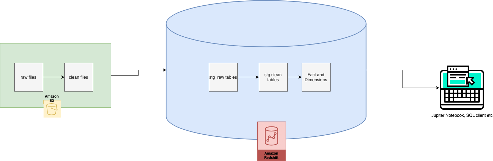
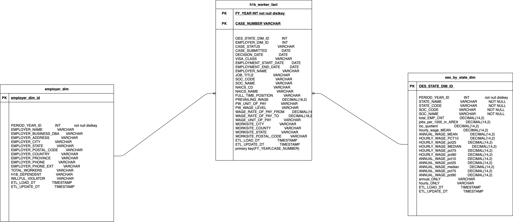

# Compensation Analytics: Analyzing H1b Compensation Data and Comparing it with State Occupational Statitics data

## Project Scope and Data Sources

All employers hiring H1b workers are required to disclose compensation for the position along with other metadata like Naics (industry) codes and SOC (Occupation Codes). Additionally the Bureau of Labor Statistics publishes annaul data on employment statistics for Naics and Soc codes like mean and medial annual wages.

The data from the above 2 data sets was sourced, modeled and loaded into a redshift databasis for analysis.

h1b data was sourced from https://www.dol.gov/agencies/eta/foreign-labor/performance and OES data from https://www.bls.gov/oes/tables.htm

The data in the redshift database can be used to answer such questions as:

- how does the mean h1b b pay in california compare to the mean pay for the entire occupation of software engineers?
- which 10 companies in california have the lowest average pay for software engineering professionals?
- which 10 companies in california have the highest average pay for software engineering professionals?
- what are the 10 occupations in California that have the lowest difference between the actual wage and what the median state wage for a given Occupation where the reported wage is lower than the median?
- what are the top 10 occupations in California that have the highest difference between the actual wage and what the median state wage for a given Occupation where the -reported wage is lower than the median
- What were some of the wages paid by udacity to its software engineers?

### Project Goal

The goal is to provide the enduser the ability to query the employment data in redshift to conduct analysis and answer questions like the ones suggested above. The redshift_h1b_analysis.ipynb file provided illustrates this.

### Data Sources

#### H1B Disclosures

- Files: h1b_disclosure_data_2017_2018.dat

The department of labor maintains several years of h1b data compensation data. For the purpose of this project, data from 2017 and 2018 will be used from a combined pipe delimited file which has a total row count of 1,279,010.  

The granularity of this data is  1 row per year, per casenumber.

This data will have specific compensation data for a potential h1b worker identified by the casenumber along with other dimensions like employer information, address, via class etc.

#### Occupational Employment Statistics Data

- Files: all_data_M_2017.xlsx, all_data_M_2018.xlsx

The Bureau of Labor Statistics maintains severel years of data on compensation statitistics for Occupational codes and Industry codes that can be segmented by different area types (National, State, Metro, etc.) This project will use data from 2017 and 2018, that is captured in 2 distinct excel files. The combined rows of both files is 831,161 rows of data.

The garnularity of this data is 1 row per area, area_type,naics, occ_code

This data will have compensation metrics like median,mean wage for a given area type (state, national etc) for a given naics and occupation code. Although several area types exist in the data set, for the purpose of this project the data at the state level will be used.

#### State Code data

- Files: state_data2.json

The state_data2.json is a json file that maps a State Code to the State name. This file will be used to enrich the OES data with state codes as the source data does not have them.

#### Naics Code Data

- Files: 2017_NAICS_Descriptions.xlsx

The naics file provides a description for every naics code. This data will be used to enrich the h1b data as the Naics description is not provided in the source dataset.

## Design and Approach



### High Level Flow

All the data will be stored in an aws s3 bucket. The data flow steps will be to:
1. Preprocessing: Preprocess the data where necessary in s3 via python/pandas and store the processed files in the same s3 bucket.
2. Staging (raw): Copy the data from s3 into redshift staging tables using the copy command.
3. Staging (clean): Apply cleansing rules to remove data anomalies like characters in numeric fields, data converstions etc.
4. Loading Dimension and Facts: Denormalizing and enriching data where applicable

Once the data is loaded in dimension and fact tables it is ready for querying by the end user via jupyter notebook or a sql client.

The source data is available on an annual basis so the ETL job will be scheduled to run annually.

### Step Detail

#### Preprocessing:

OES data in all_data_M_2017.xlsx and all_data_M_2018.xlsx will need to be converted to pipe delimited files. Also a column FY_YEAR will be added to each file at this step to signify the as-of-year of the data in each file. This is useful since these files will be staged into one table.

The 2017_NAICS_Descriptions.xlsx will also be converted to .dat pipe delimited format. See below:

- all_data_M_2017.xlsx --> clean/all_data_M_2017.dat 
- all_data_M_2018.xlsx --> clean/all_data_M_2018.dat 
- 2017_NAICS_Descriptions.xlsx --> clean/all_naics_codes.dat 

#### Staging (raw)

All files in scope will be copied from s3 into redshift. By this step all files will be in pipe-delimited .dat file or .json file. Below you can see the tables each file gets copied into.
- clean/all_data_M_2017.dat --> stg_raw_oes
- clean/all_data_M_2018.dat --> stg_raw_oes
- clean/all_naics_codes.dat --> lkp_naics_codes
- h1b_disclosure_data_2017_2018.dat --> stg_raw_h1b_disclosures
- state_data2.json --> lkp_state_codes

#### Staging (clean)

The data in the raw tables is cleaned up by converting datatypes like string to date formats, and removing bad data from fiels like non-numeric data from numeric columns.

- stg_raw_h1b_disclosures --> stg_clean_h1b_disclosures
- stg_raw_oes --> stg_clean_oes

#### Loading Dimension and Fact

The data will be modeled for analytical reporting. In thi step an Employer Dimension table, OES State Dimension table and h1b Worker Fact is loaded. this is where data is enriched, denormalized and normalized and integrated.

- stg_clean_h1b_disclosures --> employer_dim
- stg_clean_h1b_disclosures --> h1b_worker_fact
- stg_clean_oes --> oes_by_state_dim

### Data Quality Checks

Data quality checks are performed at ever stage of the database load. Below are the stages and there are 5 checks performed in total which you can see in data_quality_checks.py
1. Staged in Clean
2. Staged in Raw
3. Loaded in Dimensions
4. Loaded in Fact tables

### Technology Stack

The technology stack will consist of:
1. s3 for file storage
2. python on a local instance data preprocessing and exploratory data analysis
3. Redshift for analytical analytical data storage and ELT.

#### Technology Choice Justification

- **s3** : Storage is cheap and works well with other aws services like redshift. Can interact with it programatically. Can store large quantities of data for cheap and offers scaling and redundancy options in cases where data grows in size.
- **python** : Very flexible and libraries like pandas make data exploration simple. Also has boto3 the aws python sdk that can be used to preprocess data in s3 from any instance.The volume of data wasn't large enough to justify spark and the added complexity it would introduce. Also, more complex transformations would be done in redshift.
- **redshift** : Since it is columnar it is ideal for aggregations where only a few columns would be selected. Also, the ability to scale if data volumes increase makes it a good fit from a storage and data movement (ELT) perspective.

## Design Considerations

**What if the data is increased by 100x?**

s3 can serve as a datalake that can scale up as required for file storage. So file storage wouldn't be an issue for a 100x increase in data. Preprocessing the data in python would pose some issues with the current approach as  all of the data wouldn't be able to fit in memory. Some options to solve this would be:
1. When downloading data chunk it into manegable partitions to a size that can fit in memory. Then serially or read the partitions in python. Although this would work it might be time consuming.
2. Use spark via EMR instead to preprocess files. This way the data can be horizontally distributed in memory and preprocessed.
3. Don't preprocess the data in s3. Copy as is into redshift and do the preprocessing there in an ELT fashion by increasing the size and number of nodes in the cluster.

**The pipelines would be run on a daily basis by 7 am every day**

This wouldn't be a problem and can be scheduled with either cron to execute the job everyday at 7 am or something more robust like airflow for dependency management and orchestration.

**The database needed to be accessed by 100+ people.**

The current tech stack would enable the access by 100+ people as it is built on redshift that can handle 100+ concurrent users.

# Prerequssites

1. You should have aws credentials (access key/secret key) to use aws services like s3 and redshift programatically. I have the keys downloaded locally that lets me interact with aws.
2. VPC groups, IAM roles etc have been configured
3. Source files are loaded in an s3 bucket.
4. redshift cluster is created and available.
5. Redshift tables have been created.

# Work Files
1. **dwh.cfg :** Config file. You'll need to fill in your own details.
2. **cluster_capstone.ipynb :** This notebook is used to create and delete the redshift cluster.
3. **h1b_data_analysis.ipynb :** Notebook used for some preliminary data analysis on h1b data
4. **oes_data_analysis.ipynb :** Notebook used for some preliminary data analysis on oes data
5. **sql_queries.py :** Stores all SQL: DDL, DML etc
6. **create_tables.py :** Create database tables in redshift.
7. **s3_xlsx_to_csv.py :** Preprocesses data in s3
8. **data_quality_checks.py :** Performs data quality checks as part of etl
9. **etl.py :** Performs the end to end etl process
1. **datadictionary.txt :** data dictionary

# Data Model



For fact and dim tables a distribution strategy uses the FY_YEAR taht captures the year of the data. This way joins across these tables occur on the same nodes and therefor have good performance.

The primary key of the fact table is the fy_year and casenumber. This way the most granular data is preserved enabling users to drill down. The dimension tables have generated primary keys by setting the column to an identity.

OES_STATE_DIM_ID is based on PERIOD_YEAR_ID , STATE_CODE, SOC_CODE in oes_by_state_dim

EMPLOYER_DIM_ID is based on PERIOD_YEAR_ID and EMPLOYER_NAME  in employer_dim.

the dimension ids above are propagates in the fact to simplify table joins from the fact to the dimensions.

Since the lookup tables, lkp_state_codes and lkp_naics_codes they are distributed with diststyle all to avoid joins across nodes.


# Execution

Below is the execution flow of etl.py. The flow is idempotent, so every run will yield the same result given the same inputs.


Below is the console output of the etl.py running successfully

```
Farazs-MBP:dataeng_capstone faraz$ python etl.py 
==============PREPROCESSING DATA IN AWS S3==============
converted  all_data_M_2017  from .xlsx to .dat
converted  all_data_M_2018  from .xlsx to .dat
converted  2017_NAICS_Descriptions  from .xlsx to .dat


runtime:  288.896094083786


List files in clean bucket: 
clean/all_data_M_2017.dat
clean/all_data_M_2018.dat
clean/all_naics_codes.dat


==============STAGING RAW TABLES==============
truncating tables...
Table truncated.


truncating tables...
Table truncated.


truncating tables...
Table truncated.


truncating tables...
Table truncated.


loading tables...
Table loaded.


loading tables...
Table loaded.


loading tables...
Table loaded.


loading tables...
Table loaded.


loading tables...
Table loaded.


stage raw tables runtime (seconds):  31.326370000839233


Running Data Quality Checks for raw tables...
{'stg_raw_h1b_disclosures': 1279010, 'stg_raw_oes': 831161, 'lkp_state_codes': 51, 'lkp_naics_codes': 2196}
raw table data quality check passed


==============STAGING CLEAN TABLES==============
truncating tables...
Table truncated.


truncating tables...
Table truncated.


query running...
Table loaded.


query running...
Table loaded.


stage clean tables runtime (seconds):  66.6295120716095


Running Data Quality Checks for clean tables...
{'stg_clean_h1b_disclosures': 1279010, 'stg_clean_oes': 831161}
clean table data quality check passed


==============Loading DIMENSION TABLES==============
truncating tables...
Table truncated.


truncating tables...
Table truncated.


query running...
Table loaded.


query running...
Table loaded.


dim tables runtime (seconds):  6.118821859359741


Running Data Quality Checks for dim tables...
{'employer_dim': 141736, 'oes_by_state_dim': 69497}
General dim table data quality check passed
distinct state codes in oes_by_state_dim =  51
OES dim table state code data quality check passed


==============Loading FACT TABLES==============
truncating tables...
Table truncated.


query running...
Table loaded.


fact tables runtime (seconds):  4.021793842315674


Running Data Quality Checks for fact tables...
{'h1b_worker_fact': 1279010}
General fact table data quality check passed


TOTAL ETL runtime (seconds):  398.3936131000519

```


